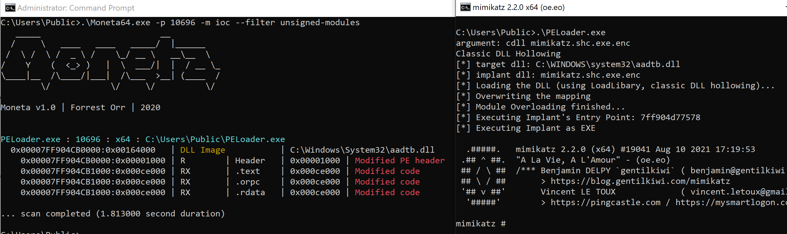
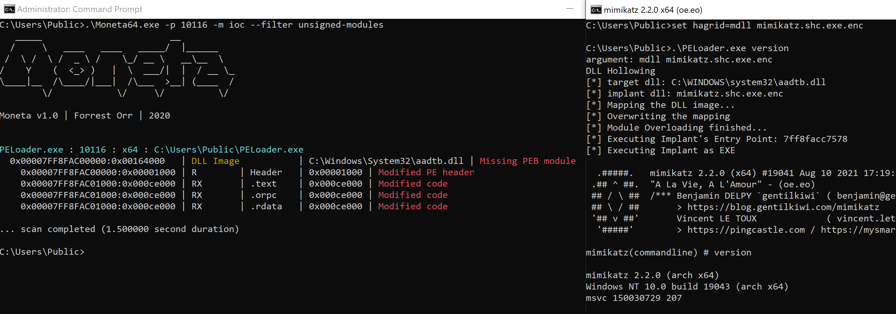
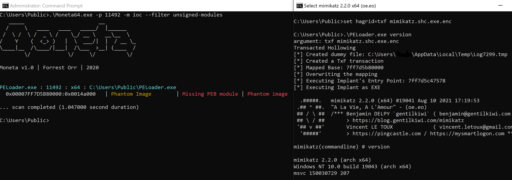
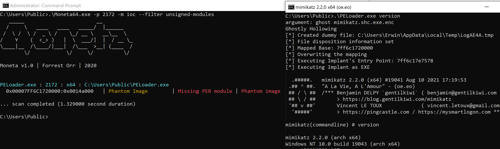
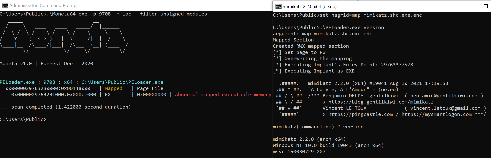
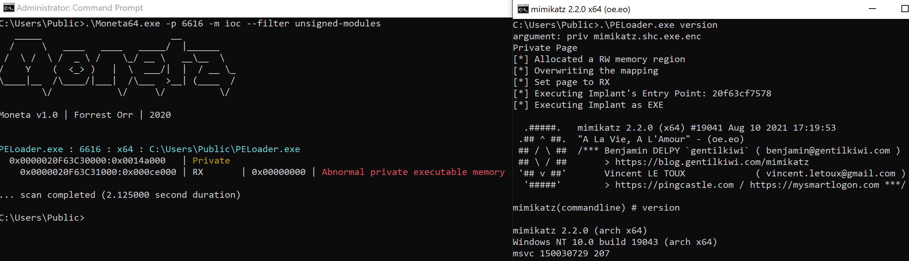

# PELoader
PELoader implement various shellcode injection techniques, and use [libpeconv](https://github.com/hasherezade/libpeconv) library to load encrypted PE files instead of injecting shellcode into remote thread.

Following techniques were implemented:

- Module Stomping (LoadLibrary)
- Module Stomping (NtMapViewOfSection) ([PoC](https://github.com/hasherezade/module_overloading))
- Transacted Hollowing ([PoC](https://github.com/hasherezade/transacted_hollowing))
- Ghostly Hollowing ([PoC](https://github.com/hasherezade/transacted_hollowing#ghostly-hollowing))
- Herpaderply Hollowing([PoC](https://github.com/Hagrid29/herpaderply_hollowing))
- NtMapViewOfSection (RWX-RW-RX)
- NtAllocateVirtualMemory (RW-RX)

Credits: most of my work was based on @hasherezade's [PoC](https://github.com/hasherezade/) scripts.

## Testing

PELoader was tested on Windows 10 with Cortex XDR / SentinalOne / Windows Defender / CrowdStrike, and Windows Defender / CrowdStrike detected Transacted Hollowing techniques. Characteristics of each techniques were tested with a memory scanner tool [Moneta](https://github.com/forrest-orr/moneta) from @forrest-orr.

**Module Stomping (LoadLibrary)**

Call LoadLibrary to load a legitimate DLL. Overwrite DLL with payload

Pros

- payload mapped as MEM_IMAGE which looks legitimate for EXE or DLL
- impersonating a legitimate DLL
- Sections mapped with original access rights (no RWX)




**Module Stomping (NtMapViewOfSection)**

Call NtCreateSection to create file mapping object (PAGE_READONLY) for a legitimate DLL, and call NtMapViewOfSection to map it to current process. Overwrite the DLL with payload.

Pros

- payload mapped as MEM_IMAGE which looks legitimate for EXE or DLL
- impersonating a legitimate DLL
- Sections mapped with original access rights (no RWX)
- Not connected to the list of modules (invisible for Module32First/Module32Next)

Cons

- Not connected to the list of modules (check "Missing PEB module" in bellow Moneta's scanning result)



reference to @hasherezade's [PoC](https://github.com/hasherezade/module_overloading).


**Transacted Hollowing**

A hybrid between Process Hollowing and Process Doppelgänging. Create “invisible” file within the NTFS transaction and write payload into the file. Map section to current process and execute it.

Pros

- Payload mapped as MEM_IMAGE
- Sections mapped with original access rights (no RWX)
- dummy file not necessary to be exist

Cons

- Detection if there is TxF activity monitoring




**Ghostly Hollowing**

A hybrid between Process Hollowing and Process Ghosting. Create a file with delete pending state and write payload into the file. Map section to current process and execute it.

Pros

- Payload mapped as MEM_IMAGE
- Sections mapped with original access rights (no RWX)
- Avoid “System Idle Process” without any image path (IOC of process ghosting)

Cron

- Dummy file created on disk

reference to @hasherezade's [PoC](https://github.com/hasherezade/transacted_hollowing).


**NtMapViewOfSection (RWX-RW-RX)**

Call NtCreateSection to create memory section (RWX). Call NtMapViewOfSection  map a view to current process (RWX). Call VirtualProtect to change protection to RW. Copy shellcode to mapped section. Change protection to RX and execute it.

Pros

- Payload mapped as MEM_MAPPED to avoid MEM_PRIVATE which is common in malware

Cons

- Set memory page to RWX protection at initial stage
- abnormal mapped EXE memory with RX protection




**NtAllocateVirtualMemory (RW-RX)**

Call NtAllocateVirtualMemory to allocate memory (RW). Copy shellcode to memory. Change protection to  RX and execute it.

Pros

- avoid RWX memory page

Cons

- staging shellcode to memory page with private type MEM_PRIVATE
- abnormal private EXE memory with RX protection




## Usage

**AES Encrypt Payload**

Convert PE file to shellcode with [pe_to_shellcode](https://github.com/hasherezade/pe_to_shellcode) and encrypted with PELoader

```
cmd> .\pe2shc.exe mimikatz.exe
Reading module from: mimikatz.exe
[WARNING] This is a console application! The recommended subsystem is GUI.
[+] Saved as: mimikatz.shc.exe
cmd> set hagrid=enc mimikatz.shc.exe
cmd> .\PELoader.exe
argument: enc mimikatz.shc.exe
Encrypting File
```

**PE Execution**

Set argument to environment variable "hagrid" and execute PELoader

```
cmd> set hagrid=cdll mimikatz.shc.exe.enc
cmd> .\PELoader.exe  version
argument: cdll mimikatz.shc.exe.enc
Classic DLL Hollowing
[*] target dll: C:\WINDOWS\system32\aadtb.dll
[*] implant dll: mimikatz.shc.exe.enc
[*] Loading the DLL (using LoadLibary, classic DLL hollowing)...
[*] Overwriting the mapping
[*] Module Overloading finished...
[*] Executing Implant's Entry Point: 7ff8cf9d7578
[*] Executing Implant as EXE

  .#####.   mimikatz 2.2.0 (x64) #19041 Aug 10 2021 17:19:53
 .## ^ ##.  "A La Vie, A L'Amour" - (oe.eo)
 ## / \ ##  /*** Benjamin DELPY `gentilkiwi` ( benjamin@gentilkiwi.com )
 ## \ / ##       > https://blog.gentilkiwi.com/mimikatz
 '## v ##'       Vincent LE TOUX             ( vincent.letoux@gmail.com )
  '#####'        > https://pingcastle.com / https://mysmartlogon.com ***/

mimikatz(commandline) # version

mimikatz 2.2.0 (arch x64)
Windows NT 10.0 build 19043 (arch x64)
msvc 150030729 207

mimikatz #
```


## Improvement

- @forrest-orr made a detailed comparison on variations of shellcode implant in this [article](https://www.forrest-orr.net/post/masking-malicious-memory-artifacts-part-iii-bypassing-defensive-scanners)
- @dglenx moved the concept to remote process injection and suggest a couple of ways to address IOCs in this [article](https://www.secforce.com/blog/dll-hollowing-a-deep-dive-into-a-stealthier-memory-allocation-variant/) 


## References

* https://github.com/hasherezade/libpeconv
* https://github.com/hasherezade/module_overloading
* https://github.com/hasherezade/transacted_hollowing
* https://www.forrest-orr.net/post/masking-malicious-memory-artifacts-part-iii-bypassing-defensive-scanners
* https://www.secforce.com/blog/dll-hollowing-a-deep-dive-into-a-stealthier-memory-allocation-variant/


